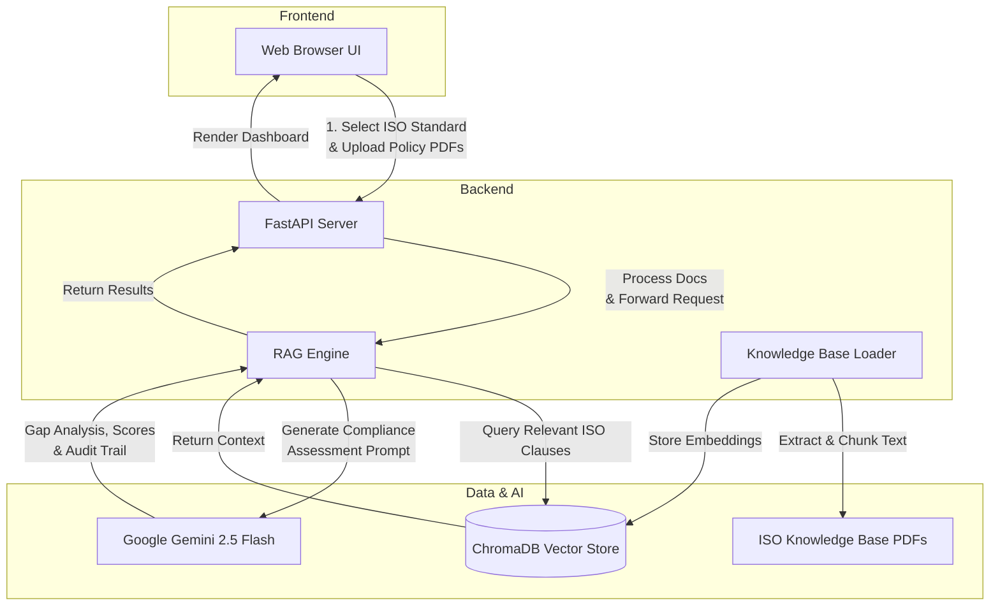

# Anupalan Mitra — Compliance Intelligence Platform

Powered by Google Gemini 2.5 Flash + ChromaDB

Anupalan Mitra is a Compliance Intelligence Platform designed to automate the process of compliance assessment. It maps company policies against standard ISO frameworks (e.g., ISO 37001, 37002, 37301, 37000) and provides a detailed gap analysis, maturity score, and compliance audit trail using Retrieval-Augmented Generation (RAG).

## System Architecture



## Prerequisites

- Python 3.10 or higher
- A Google Gemini API key
- A modern web browser (Chrome, Edge, Firefox)

## Getting Started

### 1. Configure the Environment
1. Create a `.env` file in the `backend/` directory.
2. Add your Gemini API Key:
   ```env
   GOOGLE_API_KEY=your_actual_key_here
   ```
   *(Note: The `.env` file is excluded from version control to protect your API key.)*

### 2. Install Python Dependencies (Run Once)
Open a terminal inside the `backend/` folder and run:
```bash
pip install -r requirements.txt
```

### 3. Index the ISO Knowledge Base (Run Once)
This step builds the ChromaDB vector store that Gemini uses to retrieve ISO clause references.
From inside the `backend/` folder, run:
```bash
python knowledge_base_loader.py
```
*(You only need to re-run this if you add new PDFs to the `backend/knowledge_base/` folder).*

### 4. Start the Backend Server
From inside the `backend/` folder, run:
```bash
python main.py
```
You should see output similar to: `INFO: Uvicorn running on http://0.0.0.0:8000`
*(Keep this terminal open while using the app).*

### 5. Open the Frontend
Simply double-click or open `frontend/index.html` in your web browser.

#### How to Use:
1. Select a target ISO standard from the dropdown.
2. Drag and drop (or browse and upload) your company policy PDFs.
3. Click **Generate Assessment**.
4. View the Dashboard results (Overall Maturity Score, Compliant/Non-Compliant counts, Auditor Workbench).
5. Click **Export Report** to download the plain-text audit summary.

## Demo Mode
If the backend server is NOT running, the application automatically switches to **Demo Mode** and populates a rich sample assessment, allowing you to showcase the UI without requiring a live server.

## Supported ISO Standards
The system supports the following standards (more can be added by placing PDFs into `backend/knowledge_base/` and re-indexing):
- **ISO 37001:** Anti-bribery Management Systems
- **ISO 37002:** Whistleblowing Management Systems
- **ISO 37301:** Compliance Management Systems
- **ISO 37000:** Governance of Organizations
